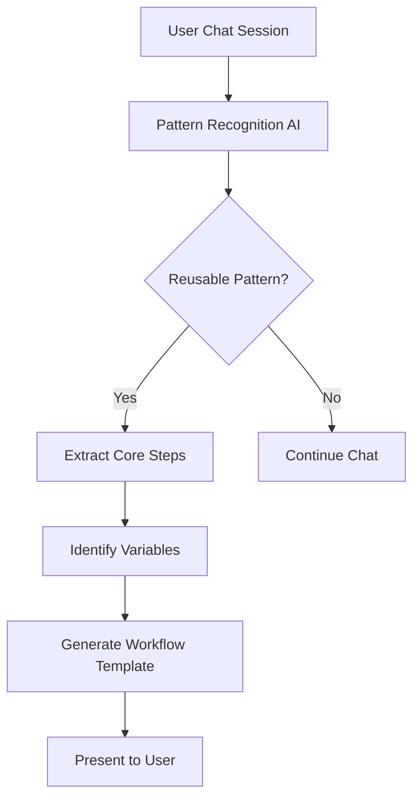

# TanukiMCP Atlas - Custom Workflow Architecture

## 🎯 Overview

The Custom Workflow Architecture enables users to transform successful chat interactions into reusable, automated workflows. This system bridges the gap between ad-hoc AI assistance and systematic process automation, allowing users to create, test, refine, and deploy intelligent workflows through natural conversation.

## 🏗️ Architecture Components

### 1. Workflow Extraction Engine
```typescript
interface WorkflowExtractionEngine {
  // Analyzes chat history to identify reusable patterns
  analyzeChat(chatHistory: ChatMessage[]): WorkflowPattern[];
  
  // Extracts prompt templates and tool sequences
  extractPromptTemplates(messages: ChatMessage[]): PromptTemplate[];
  extractToolSequences(messages: ChatMessage[]): ToolSequence[];
  
  // Identifies parameter variables
  identifyVariables(workflow: WorkflowPattern): WorkflowVariable[];
  
  // Generates workflow metadata
  generateMetadata(pattern: WorkflowPattern): WorkflowMetadata;
}
```

### 2. LangChain Workflow Generator
```typescript
interface LangChainWorkflowGenerator {
  // Converts chat patterns to LangChain graphs
  generateLangGraph(pattern: WorkflowPattern): LangGraphDefinition;
  
  // Creates prompt templates with variable substitution
  createPromptTemplates(templates: PromptTemplate[]): LangChainPromptTemplate[];
  
  // Builds tool chains and conditional logic
  buildToolChains(sequences: ToolSequence[]): LangChainToolChain[];
  
  // Implements error handling and fallbacks
  addErrorHandling(workflow: LangGraphDefinition): LangGraphDefinition;
}
```

### 3. Workflow Runtime Engine
```typescript
interface WorkflowRuntimeEngine {
  // Executes workflows with parameter substitution
  executeWorkflow(workflowId: string, parameters: WorkflowParameters): Promise<WorkflowResult>;
  
  // Handles human-in-the-loop interactions
  pauseForApproval(context: WorkflowContext): Promise<ApprovalResult>;
  
  // Manages state persistence across workflow steps
  persistState(workflowId: string, state: WorkflowState): Promise<void>;
  resumeWorkflow(workflowId: string): Promise<WorkflowResult>;
  
  // Provides real-time execution monitoring
  getExecutionStatus(workflowId: string): WorkflowExecutionStatus;
}
```

## 🔄 Workflow Creation Process

### Phase 1: Chat Analysis & Pattern Recognition


#### Pattern Recognition Criteria
```typescript
interface PatternRecognitionCriteria {
  // Minimum complexity threshold
  minimumSteps: number;           // At least 3 distinct operations
  minimumToolUse: number;         // At least 2 different tools
  
  // Repeatability indicators
  hasParametrizableInputs: boolean;  // Contains variable elements
  hasStructuredOutput: boolean;      // Produces consistent output format
  
  // Success indicators
  completedSuccessfully: boolean;    // No errors in execution
  userSatisfaction: boolean;         // User confirmed success
  
  // Complexity indicators
  hasConditionalLogic: boolean;      // Contains if/then patterns
  hasIterativeSteps: boolean;        // Contains loops or repetition
  hasErrorHandling: boolean;         // Contains fallback strategies
}
```

### Phase 2: Workflow Template Generation
```typescript
interface WorkflowTemplate {
  id: string;
  name: string;
  description: string;
  category: WorkflowCategory;
  
  // Core workflow structure
  steps: WorkflowStep[];
  variables: WorkflowVariable[];
  outputs: WorkflowOutput[];
  
  // LangChain integration
  langchainGraph: LangGraphDefinition;
  promptTemplates: LangChainPromptTemplate[];
  toolChains: LangChainToolChain[];
  
  // Execution configuration
  executionConfig: {
    timeout: number;
    retryPolicy: RetryPolicy;
    humanInLoopPoints: string[];
    errorHandling: ErrorHandlingStrategy;
  };
  
  // Metadata
  metadata: {
    createdFrom: string;           // Original chat ID
    created: Date;
    updated: Date;
    version: string;
    tags: string[];
    complexity: 'simple' | 'medium' | 'complex';
  };
}
```

#### Workflow Step Types
```typescript
type WorkflowStep = 
  | PromptStep
  | ToolExecutionStep
  | ConditionalStep
  | LoopStep
  | HumanApprovalStep
  | DataTransformationStep;

interface PromptStep {
  type: 'prompt';
  id: string;
  template: string;
  variables: string[];
  model?: string;
  temperature?: number;
  maxTokens?: number;
}

interface ToolExecutionStep {
  type: 'tool';
  id: string;
  toolName: string;
  parameters: Record<string, any>;
  outputMapping: Record<string, string>;
  errorHandling?: ErrorHandler;
}

interface ConditionalStep {
  type: 'conditional';
  id: string;
  condition: string;           // JavaScript expression
  trueStep: string;           // Next step ID if true
  falseStep: string;          // Next step ID if false
}
```

### Phase 3: LangChain Graph Construction
```typescript
interface LangGraphDefinition {
  nodes: LangGraphNode[];
  edges: LangGraphEdge[];
  entryPoint: string;
  exitPoints: string[];
  
  // State management
  stateSchema: StateSchema;
  reducers: Record<string, ReducerFunction>;
  
  // Persistence configuration
  checkpointing: CheckpointingConfig;
  memoryConfig: MemoryConfig;
}

// Example LangGraph construction for "Project Analysis Workflow"
const projectAnalysisWorkflow: LangGraphDefinition = {
  nodes: [
    {
      id: 'analyze_requirements',
      type: 'prompt',
      template: 'Analyze the following project requirements: {requirements}',
      outputKey: 'analysis'
    },
    {
      id: 'identify_files',
      type: 'tool',
      toolName: 'search_files',
      parameters: { pattern: '{project_path}/**/*' },
      outputKey: 'files'
    },
    {
      id: 'create_plan',
      type: 'prompt',
      template: 'Based on {analysis} and {files}, create a development plan',
      outputKey: 'plan'
    },
    {
      id: 'generate_todolist',
      type: 'tool',
      toolName: 'create_todolist',
      parameters: { plan: '{plan}' },
      outputKey: 'todolist'
    }
  ],
  edges: [
    { from: 'analyze_requirements', to: 'identify_files' },
    { from: 'identify_files', to: 'create_plan' },
    { from: 'create_plan', to: 'generate_todolist' }
  ],
  entryPoint: 'analyze_requirements',
  exitPoints: ['generate_todolist']
};
```

## 💾 Workflow Storage & Management

### Workflow Database Schema
```sql
-- Workflows table
CREATE TABLE workflows (
  id TEXT PRIMARY KEY,
  name TEXT NOT NULL,
  description TEXT,
  category TEXT NOT NULL,
  definition JSON NOT NULL,        -- LangGraph definition
  variables JSON NOT NULL,         -- Variable definitions
  metadata JSON NOT NULL,          -- Creation info, tags, etc.
  is_active BOOLEAN DEFAULT true,
  created_at TIMESTAMP DEFAULT CURRENT_TIMESTAMP,
  updated_at TIMESTAMP DEFAULT CURRENT_TIMESTAMP
);

-- Workflow executions
CREATE TABLE workflow_executions (
  id TEXT PRIMARY KEY,
  workflow_id TEXT REFERENCES workflows(id),
  parameters JSON NOT NULL,        -- Input parameters
  status TEXT NOT NULL,           -- pending, running, completed, failed
  result JSON,                    -- Execution result
  error_message TEXT,
  started_at TIMESTAMP DEFAULT CURRENT_TIMESTAMP,
  completed_at TIMESTAMP,
  execution_time_ms INTEGER
);

-- Workflow execution steps
CREATE TABLE workflow_execution_steps (
  id TEXT PRIMARY KEY,
  execution_id TEXT REFERENCES workflow_executions(id),
  step_id TEXT NOT NULL,
  step_type TEXT NOT NULL,
  input_data JSON,
  output_data JSON,
  status TEXT NOT NULL,
  error_message TEXT,
  started_at TIMESTAMP DEFAULT CURRENT_TIMESTAMP,
  completed_at TIMESTAMP,
  execution_time_ms INTEGER
);

-- Workflow sharing and templates
CREATE TABLE workflow_templates (
  id TEXT PRIMARY KEY,
  workflow_id TEXT REFERENCES workflows(id),
  is_public BOOLEAN DEFAULT false,
  download_count INTEGER DEFAULT 0,
  rating REAL DEFAULT 0.0,
  created_at TIMESTAMP DEFAULT CURRENT_TIMESTAMP
);
```

### Workflow Categories
```typescript
enum WorkflowCategory {
  // Code & Development
  CODE_GENERATION = 'code_generation',
  CODE_REVIEW = 'code_review',
  DEBUGGING = 'debugging',
  TESTING = 'testing',
  DOCUMENTATION = 'documentation',
  
  // Project Management
  PROJECT_ANALYSIS = 'project_analysis',
  TASK_PLANNING = 'task_planning',
  PROGRESS_TRACKING = 'progress_tracking',
  
  // Data Processing
  DATA_ANALYSIS = 'data_analysis',
  FILE_PROCESSING = 'file_processing',
  CONTENT_GENERATION = 'content_generation',
  
  // Research & Learning
  RESEARCH = 'research',
  LEARNING = 'learning',
  EXPLORATION = 'exploration',
  
  // Custom
  CUSTOM = 'custom'
}
```

## 🎮 User Interface Integration

### "Save Chat as Workflow" Button
```typescript
interface SaveWorkflowDialog {
  // Workflow identification
  workflowName: string;
  description: string;
  category: WorkflowCategory;
  tags: string[];
  
  // Step selection
  selectedMessages: string[];        // Message IDs to include
  startMessage: string;              // First message in workflow
  endMessage: string;                // Last message in workflow
  
  // Variable identification
  detectedVariables: WorkflowVariable[];
  userDefinedVariables: WorkflowVariable[];
  
  // Preview
  generatedWorkflow: WorkflowTemplate;
  previewAvailable: boolean;
}

// Example UI component
const SaveWorkflowButton: React.FC<{ chatId: string }> = ({ chatId }) => {
  const [showDialog, setShowDialog] = useState(false);
  const [analysis, setAnalysis] = useState<WorkflowAnalysis | null>(null);
  
  const analyzeChat = async () => {
    const chat = await getChatHistory(chatId);
    const patterns = await WorkflowExtractionEngine.analyzeChat(chat.messages);
    setAnalysis({ patterns, suggestions: generateSuggestions(patterns) });
  };
  
  return (
    <Button 
      onClick={() => { analyzeChat(); setShowDialog(true); }}
      className="workflow-save-btn"
    >
      💾 Save as Workflow
    </Button>
  );
};
```

### @workflows/ Tool Integration
```typescript
// Workflow execution through @ symbol
const WorkflowTool: MCPTool = {
  name: 'execute_workflow',
  description: 'Execute a saved workflow with parameters',
  inputSchema: {
    type: 'object',
    properties: {
      workflowId: { type: 'string', description: 'Workflow ID or name' },
      parameters: { type: 'object', description: 'Workflow parameters' },
      preview: { type: 'boolean', description: 'Preview mode (dry run)' }
    },
    required: ['workflowId']
  }
};

// Usage in chat:
// @workflows/project-analysis requirements="Build a task manager" project_path="./src"
```

### Workflow Browser Interface
```
┌─────────────────────────────────────────────────────────────┐
│ 🔧 WORKFLOW MANAGER                               [+ Create] │
├─────────────────────────────────────────────────────────────┤
│ 🔍 [Search workflows...]              [Category ▼] [Sort ▼] │
├─────────────────────────────────────────────────────────────┤
│                                                            │
│ MY WORKFLOWS                                               │
│ ┌──────────────────────────────────────────────────────┐   │
│ │ 🏗️ Project Analysis                      [▶️ Run]    │   │
│ │    Analyzes requirements and creates development plan │   │
│ │    Variables: requirements, project_path              │   │
│ │    Last used: 2 days ago • Success rate: 95%         │   │
│ │    [✏️ Edit] [📋 Copy] [🗑️ Delete] [📤 Share]       │   │
│ └──────────────────────────────────────────────────────┘   │
│                                                            │
│ ┌──────────────────────────────────────────────────────┐   │
│ │ 🧪 Code Review                           [▶️ Run]    │   │
│ │    Reviews code changes and suggests improvements     │   │
│ │    Variables: file_path, review_type                  │   │
│ │    Last used: 1 week ago • Success rate: 87%         │   │
│ │    [✏️ Edit] [📋 Copy] [🗑️ Delete] [📤 Share]       │   │
│ └──────────────────────────────────────────────────────┘   │
│                                                            │
│ COMMUNITY TEMPLATES                                        │
│ ┌──────────────────────────────────────────────────────┐   │
│ │ 📊 Data Pipeline Creator          [⭐ 4.8] [📥 Install] │
│ │    Creates ETL pipelines with validation and testing  │   │
│ │    Downloads: 1.2k • Created by: @data-wizard        │   │
│ └──────────────────────────────────────────────────────┘   │
│                                                            │
│ ┌──────────────────────────────────────────────────────┐   │
│ │ 🎨 UI Component Generator        [⭐ 4.6] [📥 Install] │
│ │    Generates React components with TypeScript         │   │
│ │    Downloads: 890 • Created by: @react-master        │   │
│ └──────────────────────────────────────────────────────┘   │
└─────────────────────────────────────────────────────────────┘
```

## 🚀 Advanced Features

### 1. Workflow Versioning
```typescript
interface WorkflowVersion {
  id: string;
  workflowId: string;
  version: string;              // Semantic versioning
  changes: string;              // Change description
  parentVersion?: string;       // Parent version ID
  isActive: boolean;            // Current active version
  
  // Backward compatibility
  migrationScript?: string;     // Auto-migration for old parameters
  deprecationWarning?: string;  // Warning for deprecated features
}
```

### 2. Workflow Composition
```typescript
interface CompositeWorkflow {
  id: string;
  name: string;
  subWorkflows: SubWorkflow[];
  
  // Orchestration
  executionMode: 'sequential' | 'parallel' | 'conditional';
  dataFlow: DataFlowMapping[];
  
  // Error handling
  failurePolicy: 'stop' | 'continue' | 'retry';
  rollbackStrategy?: RollbackStrategy;
}

interface SubWorkflow {
  workflowId: string;
  parameters: ParameterMapping;
  condition?: string;           // Execution condition
  timeout?: number;
}
```

### 3. Intelligent Workflow Suggestions
```typescript
interface WorkflowSuggestionEngine {
  // Analyze current context and suggest workflows
  suggestWorkflows(context: ChatContext): WorkflowSuggestion[];
  
  // Learn from user behavior
  learnFromExecution(execution: WorkflowExecution): void;
  
  // Recommend optimizations
  suggestOptimizations(workflow: WorkflowTemplate): OptimizationSuggestion[];
}

interface WorkflowSuggestion {
  workflowId: string;
  confidence: number;           // 0-1 confidence score
  reason: string;               // Why this workflow was suggested
  parameterSuggestions: Record<string, any>;
}
```

### 4. A/B Testing for Workflows
```typescript
interface WorkflowExperiment {
  id: string;
  workflowId: string;
  variants: WorkflowVariant[];
  trafficSplit: number[];       // Percentage allocation
  metrics: ExperimentMetric[];
  status: 'draft' | 'running' | 'completed';
  
  // Statistical analysis
  significance: number;
  winner?: string;              // Winning variant ID
}

interface WorkflowVariant {
  id: string;
  name: string;
  changes: WorkflowChange[];    // Modifications from base
  performance: VariantPerformance;
}
```

## 📊 Analytics & Monitoring

### Workflow Performance Metrics
```typescript
interface WorkflowMetrics {
  // Execution metrics
  totalExecutions: number;
  successRate: number;
  averageExecutionTime: number;
  errorRate: number;
  
  // Performance trends
  executionTrend: TimeSeries;
  successRateTrend: TimeSeries;
  errorTrend: TimeSeries;
  
  // Step-level analysis
  stepPerformance: StepMetrics[];
  bottlenecks: BottleneckAnalysis[];
  
  // User satisfaction
  userRatings: UserRating[];
  feedbackScore: number;
}

interface StepMetrics {
  stepId: string;
  avgExecutionTime: number;
  successRate: number;
  errorRate: number;
  retryRate: number;
}
```

### Real-time Monitoring Dashboard
```
┌─────────────────────────────────────────────────────────────┐
│ 📊 WORKFLOW ANALYTICS                                       │
├─────────────────────────────────────────────────────────────┤
│                                                            │
│ OVERVIEW (Last 30 days)                                   │
│ 🚀 Executions: 1,247    ✅ Success: 94.2%   ⏱️ Avg: 2.3s │
│ 🔄 Active: 3            ❌ Errors: 5.8%     🎯 Popular: 7  │
│                                                            │
│ PERFORMANCE CHART                                          │
│ ┌────────────────────────────────────────────────────────┐ │
│ │     Success Rate %                                     │ │
│ │ 100 ┼─────────────────────*──────*─────────────────── │ │
│ │  90 ┤                  *     *                        │ │
│ │  80 ┤               *                                 │ │
│ │  70 ┤            *                                    │ │
│ │  60 ┼─────*──────┼─────────┼─────────┼─────────┼───── │ │
│ │     Day 1   Day 7   Day 14  Day 21   Day 28  Today   │ │
│ └────────────────────────────────────────────────────────┘ │
│                                                            │
│ TOP PERFORMING WORKFLOWS                                   │
│ 1. 🏗️ Project Analysis      (98.5% success, 892 runs)     │
│ 2. 🧪 Code Review          (96.2% success, 445 runs)     │
│ 3. 📊 Data Processing      (94.8% success, 287 runs)     │
│                                                            │
│ RECENT ERRORS                                              │
│ • Tool timeout in "File Analysis" workflow (2 hours ago)  │
│ • Parameter validation failed (5 hours ago)               │
│ • LLM API rate limit reached (1 day ago)                  │
│                                                            │
│ [📈 Detailed Analytics] [🔧 Optimize Workflows] [📤 Export]│
└─────────────────────────────────────────────────────────────┘
```

## 🔧 Implementation Strategy

### Development Phases
1. **Phase 1:** Basic workflow extraction and template generation
2. **Phase 2:** LangChain integration and execution engine
3. **Phase 3:** Advanced UI and workflow management
4. **Phase 4:** Analytics, versioning, and optimization
5. **Phase 5:** Community features and marketplace

### Integration Points
- **Phase 6** of main implementation (Tool Router) will include @workflows/ integration
- **Phase 7** (UI Implementation) will include workflow management interfaces
- **Phase 8** (Management Center) will include workflow analytics

This architecture transforms TanukiMCP Atlas from a powerful AI assistant into a comprehensive workflow automation platform, enabling users to systematically capture, refine, and deploy their AI-assisted processes. 